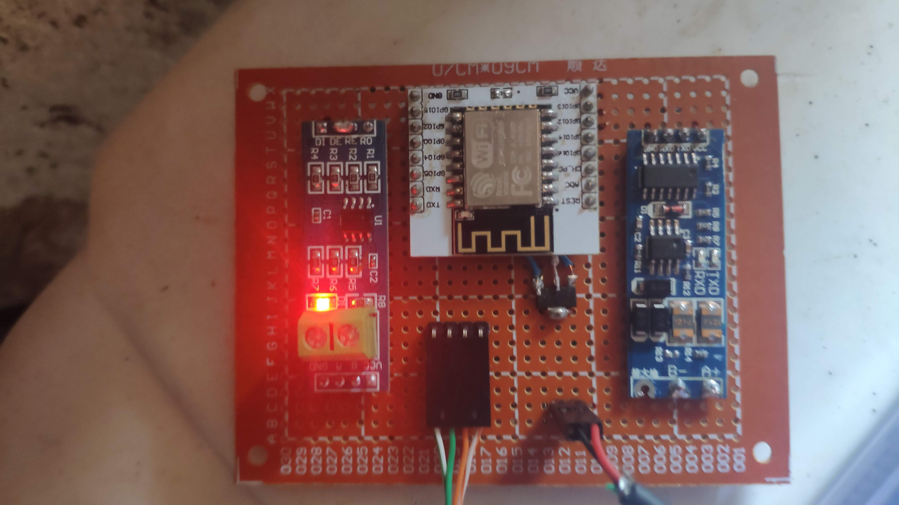

# Sofar rs485 logger

## Description:
SofarSolar inverters can be monitored by using solarman cloud by default, however I wanted to log all the inverter data in home assistant with a complete integration. This can be accomplish by reading the rs485 registers from the inverter as described in SofarSolar documentation. 
Also my on-grid inverter can't track the power that is purchased from the grid. In order to solve this problem I added an external chint ddsu666 metter. 
By using rs485 I can read the power from the metter and by doing this I can compute the exported and purchased energy from the grid to send this data to home assistant. 

## Features:
* Integration with home assistant
* Logs all the inverter info that can be accesed by the rs485 registers
* By using the chint ddsu666 external metter, can compute and send the exported/purchased energy from the grid

## Parts:
* Esp8266 
* 2x RS485 to TTL converter, in this case I am using two different boards but you can use two of the same type, you need two converters in order to read information from the inverter and from the external metter.

## Prototype:

